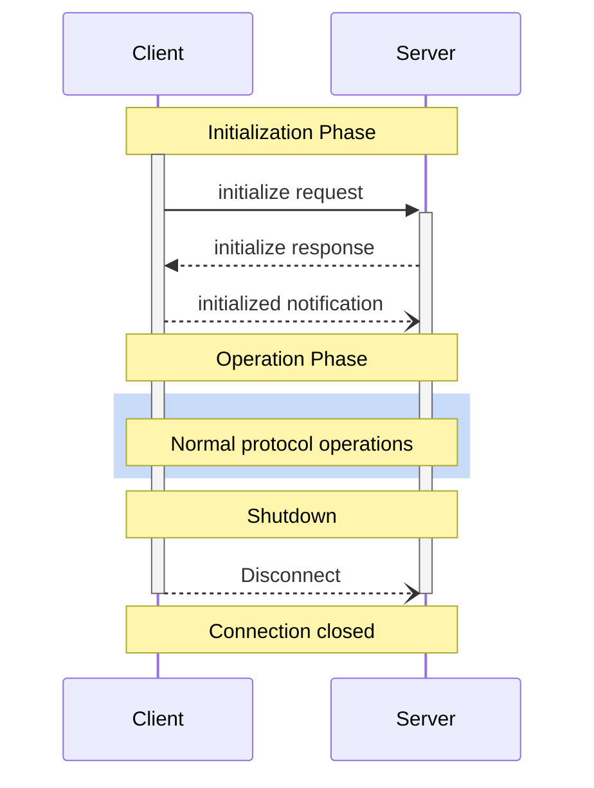

MCP is a `Stateful Protocol` (_A subset of MCP can be made stateless using the **Streamable HTTP transport**_) that requires lifecycle management. The purpose of lifecycle management is to negotiate the capabilities that both client and server support. 
It defines a rigorous lifecycle for client-server connections that ensures proper capability negotiation and state management.

## Lifecycle Phases
1. **Initialization**: Capability negotiation and protocol version agreement
2. **Operation**: Normal protocol communication
3. **Shutdown**: Graceful termination of the connection



### Initialization

The initialization phase **MUST** be the first interaction between client and server.
During this phase, the client and server:

* Establish protocol version compatibility
* Exchange and negotiate capabilities
* Share implementation details

The client **MUST** initiate this phase by sending an `initialize` request containing:

* Protocol version supported
* Client capabilities
* Client implementation information

```json
{
  "jsonrpc": "2.0",
  "id": 1,
  "method": "initialize",
  "params": {
    "protocolVersion": "2024-11-05",
    "capabilities": {
      "roots": {
        "listChanged": true
      },
      "sampling": {},
      "elicitation": {}
    },
    "clientInfo": {
      "name": "ExampleClient",
      "title": "Example Client Display Name",
      "version": "1.0.0"
    }
  }
}
```

The server **MUST** respond with its own capabilities and information:

```json
{
  "jsonrpc": "2.0",
  "id": 1,
  "result": {
    "protocolVersion": "2024-11-05",
    "capabilities": {
      "logging": {},
      "prompts": {
        "listChanged": true
      },
      "resources": {
        "subscribe": true,
        "listChanged": true
      },
      "tools": {
        "listChanged": true
      }
    },
    "serverInfo": {
      "name": "ExampleServer",
      "title": "Example Server Display Name",
      "version": "1.0.0"
    },
    "instructions": "Optional instructions for the client"
  }
}
```

After successful initialization, the client **MUST** send an `initialized` notification
to indicate it is ready to begin normal operations:

```json
{
  "jsonrpc": "2.0",
  "method": "notifications/initialized"
}
```

* The client **SHOULD NOT** send requests other than
  [pings](/docs/concepts/architecture-overview/layers/data-layer/utility-features/ping/) before the server has responded to the
  `initialize` request.
* The server **SHOULD NOT** send requests other than
  [pings](/docs/concepts/architecture-overview/layers/data-layer/utility-features/ping/) and
  [logging](/docs/concepts/architecture-overview/layers/data-layer/utility-features/logging/) before receiving the `initialized`
  notification.

#### Version Negotiation

In the `initialize` request, the client **MUST** send a protocol version it supports.
This **SHOULD** be the *latest* version supported by the client.

If the server supports the requested protocol version, it **MUST** respond with the same
version. Otherwise, the server **MUST** respond with another protocol version it
supports. This **SHOULD** be the *latest* version supported by the server.

If the client does not support the version in the server's response, it **SHOULD**
disconnect.

{}
  If using HTTP, the client **MUST** include the `MCP-Protocol-Version: <protocol-version>` HTTP header on all subsequent requests to the MCP
  server.
{}


#### Capability Negotiation

Client and server capabilities establish which optional protocol features will be
available during the session.

Key capabilities include:


| Category | Capability     | Description                                                                               |
| -------- | -------------- | ----------------------------------------------------------------------------------------- |
| Client   | `roots`        | Ability to provide filesystem [roots](/docs/concepts/client-concepts/roots)|
|
| Client   | `sampling`     | Support for LLM [sampling](/docs/concepts/client-concepts/sampling/) requests            |
|
| Client   | `elicitation`  | Support for server [elicitation](/docs/concepts/client-concepts/elicitation/) requests   |
|
| Client   | `experimental` | Describes support for non-standard experimental features                                  |
|
| Server   | `prompts`      | Offers [prompt templates](/docs/concepts/server-concepts/prompts)                       |
|
| Server   | `resources`    | Provides readable [resources](/docs/concepts/server-concepts/resources)                 |
|
| Server   | `tools`        | Exposes callable [tools](/docs/concepts/server-concepts/tools)                          |
|
| Server   | `logging`      | Emits structured [log messages](/docs/concepts/architecture-overview/layers/data-layer/utility-features/logging/)       |
|
| Server   | `completions`  | Supports argument [autocompletion](/docs/concepts/architecture-overview/layers/data-layer/utility-features/completion/) |
|
| Server   | `experimental` | Describes support for non-standard experimental features                                  |


Capability objects can describe sub-capabilities like:

* `listChanged`: Support for list change notifications (for prompts, resources, and
  tools)
* `subscribe`: Support for subscribing to individual items' changes (resources only)

### Operation

During the operation phase, the client and server exchange messages according to the
negotiated capabilities.

Both parties **MUST**:

* Respect the negotiated protocol version
* Only use capabilities that were successfully negotiated

### Shutdown

During the shutdown phase, one side (usually the client) cleanly terminates the protocol
connection. No specific shutdown messages are defined—instead, the underlying transport
mechanism should be used to signal connection termination:

#### stdio

For the stdio [transport](/docs/concepts/architecture-overview/layers/transport-layer/stdio), the client **SHOULD** initiate
shutdown by:

1. First, closing the input stream to the child process (the server)
2. Waiting for the server to exit, or sending `SIGTERM` if the server does not exit
   within a reasonable time
3. Sending `SIGKILL` if the server does not exit within a reasonable time after `SIGTERM`

The server **MAY** initiate shutdown by closing its output stream to the client and
exiting.

#### HTTP

For HTTP [transports](/docs/concepts/architecture-overview/layers/transport-layer/streamable-http), shutdown is indicated by closing the
associated HTTP connection(s).

## Timeouts

Implementations **SHOULD** establish timeouts for all sent requests, to prevent hung
connections and resource exhaustion. When the request has not received a success or error
response within the timeout period, the sender **SHOULD** issue a [cancellation
notification](/docs/concepts/architecture-overview/layers/data-layer/utility-features/cancellation/) for that request and stop waiting for
a response.

SDKs and other middleware **SHOULD** allow these timeouts to be configured on a
per-request basis.

Implementations **MAY** choose to reset the timeout clock when receiving a [progress
notification](/docs/concepts/architecture-overview/layers/data-layer/utility-features/progress/) corresponding to the request, as this
implies that work is actually happening. However, implementations **SHOULD** always
enforce a maximum timeout, regardless of progress notifications, to limit the impact of a
misbehaving client or server.

## Error Handling

Implementations **SHOULD** be prepared to handle these error cases:

* Protocol version mismatch
* Failure to negotiate required capabilities
* Request [timeouts](#timeouts)

Example initialization error:

```json
{
  "jsonrpc": "2.0",
  "id": 1,
  "error": {
    "code": -32602,
    "message": "Unsupported protocol version",
    "data": {
      "supported": ["2024-11-05"],
      "requested": "1.0.0"
    }
  }
}
```