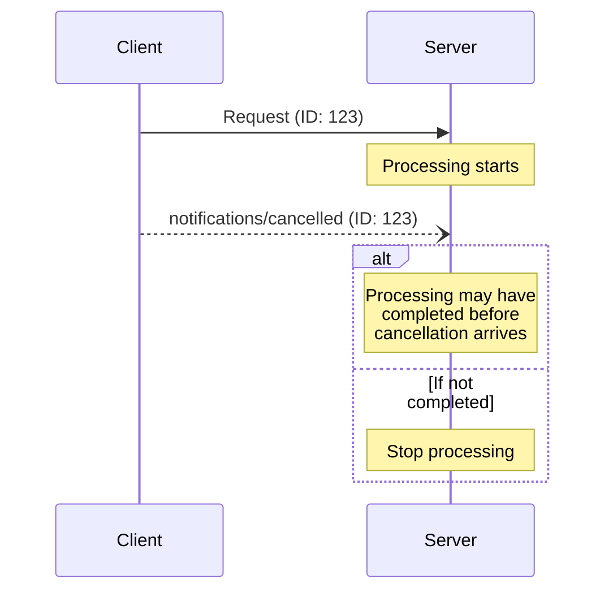

When a party wants to cancel an in-progress request, it sends a `notifications/cancelled`
notification containing:

* The ID of the request to cancel
* An optional reason string that can be logged or displayed

```json
{
  "jsonrpc": "2.0",
  "method": "notifications/cancelled",
  "params": {
    "requestId": "123",
    "reason": "User requested cancellation"
  }
}
```

## Behavior Requirements

1. Cancellation notifications **MUST** only reference requests that:
   * Were previously issued in the same direction
   * Are believed to still be in-progress
2. The `initialize` request **MUST NOT** be cancelled by clients
3. Receivers of cancellation notifications **SHOULD**:
   * Stop processing the cancelled request
   * Free associated resources
   * Not send a response for the cancelled request
4. Receivers **MAY** ignore cancellation notifications if:
   * The referenced request is unknown
   * Processing has already completed
   * The request cannot be cancelled
5. The sender of the cancellation notification **SHOULD** ignore any response to the
   request that arrives afterward

## Timing Considerations

Due to network latency, cancellation notifications may arrive after request processing
has completed, and potentially after a response has already been sent.

Both parties **MUST** handle these race conditions gracefully:



## Implementation Notes

* Both parties **SHOULD** log cancellation reasons for debugging
* Application UIs **SHOULD** indicate when cancellation is requested

## Error Handling

Invalid cancellation notifications **SHOULD** be ignored:

* Unknown request IDs
* Already completed requests
* Malformed notifications

This maintains the "fire and forget" nature of notifications while allowing for race
conditions in asynchronous communication.