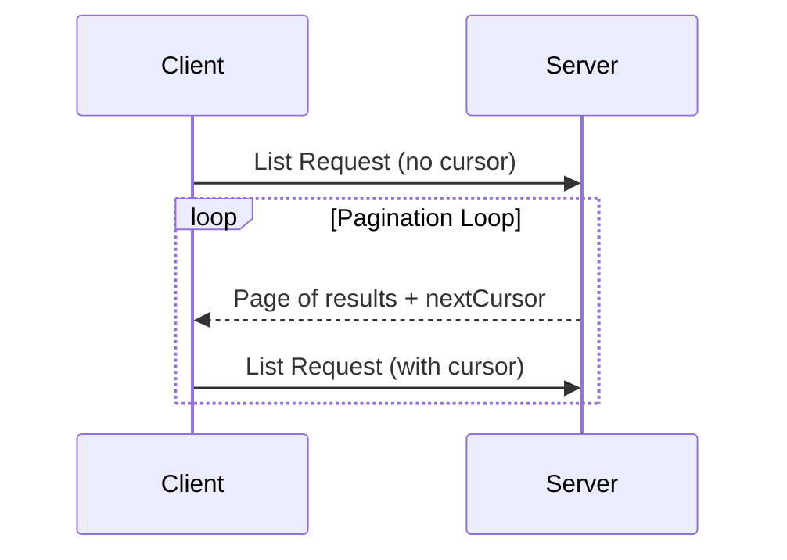

Pagination in MCP uses an opaque cursor-based approach, instead of numbered pages.

* The **cursor** is an opaque string token, representing a position in the result set
* **Page size** is determined by the server, and clients **MUST NOT** assume a fixed page
  size

## Response Format

Pagination starts when the server sends a **response** that includes:

* The current page of results
* An optional `nextCursor` field if more results exist

```json
{
  "jsonrpc": "2.0",
  "id": "123",
  "result": {
    "resources": [...],
    "nextCursor": "eyJwYWdlIjogM30="
  }
}
```

## Request Format

After receiving a cursor, the client can *continue* paginating by issuing a request
including that cursor:

```json
{
  "jsonrpc": "2.0",
  "method": "resources/list",
  "params": {
    "cursor": "eyJwYWdlIjogMn0="
  }
}
```

## Pagination Flow



## Operations Supporting Pagination

The following MCP operations support pagination:

* `resources/list` - List available resources
* `resources/templates/list` - List resource templates
* `prompts/list` - List available prompts
* `tools/list` - List available tools

## Implementation Guidelines

1. Servers **SHOULD**:

   * Provide stable cursors
   * Handle invalid cursors gracefully

2. Clients **SHOULD**:

   * Treat a missing `nextCursor` as the end of results
   * Support both paginated and non-paginated flows

3. Clients **MUST** treat cursors as opaque tokens:
   * Don't make assumptions about cursor format
   * Don't attempt to parse or modify cursors
   * Don't persist cursors across sessions

## Error Handling

Invalid cursors **SHOULD** result in an error with code -32602 (Invalid params).