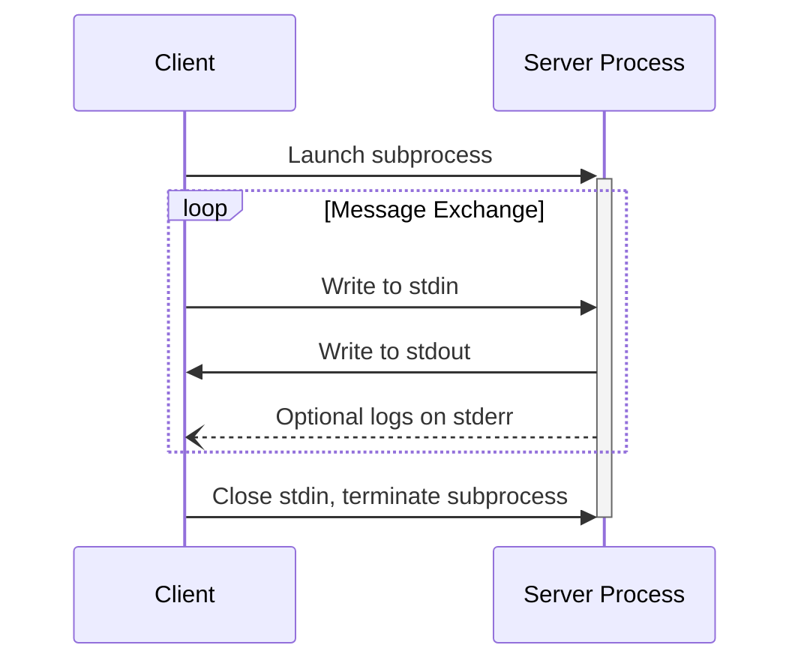

In the **stdio** transport:

1. The client launches the MCP server as a subprocess.
2. The server reads JSON-RPC messages from its standard input (`stdin`) and sends messages
   to its standard output (`stdout`).
3. Messages are individual JSON-RPC requests, notifications, or responses.
4. Messages are delimited by newlines, and **MUST NOT** contain embedded newlines.
5. The server **MAY** write UTF-8 strings to its standard error (`stderr`) for logging
   purposes. Clients **MAY** capture, forward, or ignore this logging.
6. The server **MUST NOT** write anything to its `stdout` that is not a valid MCP message.
7. The client **MUST NOT** write anything to the server's `stdin` that is not a valid MCP message.

