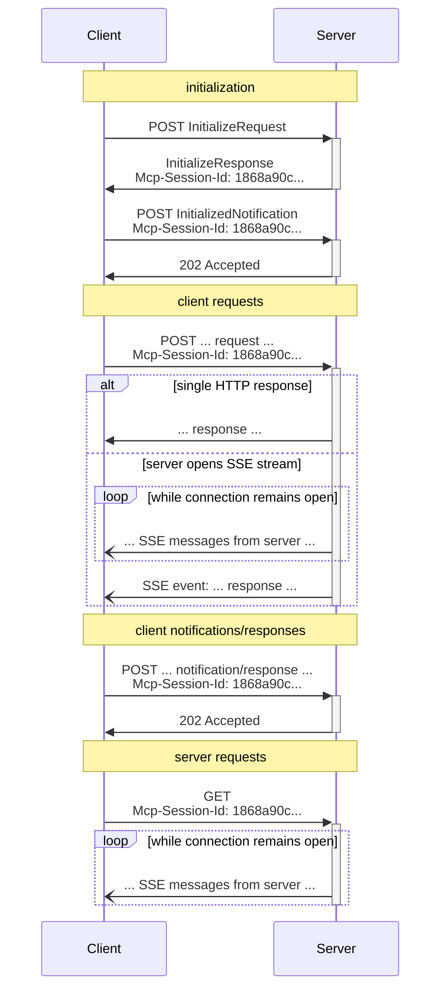

In the **Streamable HTTP** transport, the server operates as an independent process that
can handle multiple client connections. This transport uses HTTP POST and GET requests.
Server can optionally make use of
[Server-Sent Events](https://en.wikipedia.org/wiki/Server-sent_events) (SSE) to stream
multiple server messages. This permits basic MCP servers, as well as more feature-rich
servers supporting streaming and server-to-client notifications and requests.

The server **MUST** provide a single HTTP endpoint path (hereafter referred to as the
**MCP endpoint**) that supports both POST and GET methods. For example, this could be a
URL like `https://mcpindotnet.github.io/mcp`.

Let's break down how this transport works in detail:

### Sending Messages to the Server

Every JSON-RPC message sent from the client **MUST** be a new HTTP POST request to the
MCP endpoint.

1. The client **MUST** use HTTP POST to send JSON-RPC messages to the MCP endpoint.
2. The client **MUST** include an `Accept` header, listing both `application/json` and
   `text/event-stream` as supported content types.
3. The body of the POST request **MUST** be a single JSON-RPC *request*, *notification*, or *response*.
4. If the input is a JSON-RPC *response* or *notification*:
   * If the server accepts the input, the server **MUST** return HTTP status code 202
     Accepted with no body.
   * If the server cannot accept the input, it **MUST** return an HTTP error status code
     (e.g., 400 Bad Request). The HTTP response body **MAY** comprise a JSON-RPC *error
     response* that has no `id`.
5. If the input is a JSON-RPC *request*, the server **MUST** either
   return `Content-Type: text/event-stream`, to initiate an SSE stream, or
   `Content-Type: application/json`, to return one JSON object. The client **MUST**
   support both these cases.
6. If the server initiates an SSE stream:
   * The SSE stream **SHOULD** eventually include JSON-RPC *response* for the
     JSON-RPC *request* sent in the POST body.
   * The server **MAY** send JSON-RPC *requests* and *notifications* before sending the
     JSON-RPC *response*. These messages **SHOULD** relate to the originating client
     *request*.
   * The server **SHOULD NOT** close the SSE stream before sending the JSON-RPC *response*
     for the received JSON-RPC *request*, unless the [session](#session-management)
     expires.
   * After the JSON-RPC *response* has been sent, the server **SHOULD** close the SSE
     stream.
   * Disconnection **MAY** occur at any time (e.g., due to network conditions).
     Therefore:
     * Disconnection **SHOULD NOT** be interpreted as the client cancelling its request.
     * To cancel, the client **SHOULD** explicitly send an MCP `CancelledNotification`.
     * To avoid message loss due to disconnection, the server **MAY** make the stream
       [resumable](#resumability-and-redelivery).

### Listening for Messages from the Server

1. The client **MAY** issue an HTTP GET to the MCP endpoint. This can be used to open an
   SSE stream, allowing the server to communicate to the client, without the client first
   sending data via HTTP POST.
2. The client **MUST** include an `Accept` header, listing `text/event-stream` as a
   supported content type.
3. The server **MUST** either return `Content-Type: text/event-stream` in response to
   this HTTP GET, or else return HTTP 405 Method Not Allowed, indicating that the server
   does not offer an SSE stream at this endpoint.
4. If the server initiates an SSE stream:
   * The server **MAY** send JSON-RPC *requests* and *notifications* on the stream.
   * These messages **SHOULD** be unrelated to any concurrently-running JSON-RPC
     *request* from the client.
   * The server **MUST NOT** send a JSON-RPC *response* on the stream **unless**
     [resuming](#resumability-and-redelivery) a stream associated with a previous client
     request.
   * The server **MAY** close the SSE stream at any time.
   * The client **MAY** close the SSE stream at any time.

### Multiple Connections

1. The client **MAY** remain connected to multiple SSE streams simultaneously.
2. The server **MUST** send each of its JSON-RPC messages on only one of the connected
   streams; that is, it **MUST NOT** broadcast the same message across multiple streams.
   * The risk of message loss **MAY** be mitigated by making the stream
     [resumable](#resumability-and-redelivery).

### Resumability and Redelivery

To support resuming broken connections, and redelivering messages that might otherwise be
lost:

1. Servers **MAY** attach an `id` field to their SSE events, as described in the
   [SSE standard](https://html.spec.whatwg.org/multipage/server-sent-events.html#event-stream-interpretation)
   * If present, the ID **MUST** be globally unique across all streams within that
     [session](#session-management)—or all streams with that specific client, if session
     management is not in use.
2. If the client wishes to resume after a broken connection, it **SHOULD** issue an HTTP
   GET to the MCP endpoint, and include the
   [`Last-Event-ID`](https://html.spec.whatwg.org/multipage/server-sent-events.html#the-last-event-id-header)
   header to indicate the last event ID it received.
   * The server **MAY** use this header to replay messages that would have been sent
     after the last event ID, *on the stream that was disconnected*, and to resume the
     stream from that point.
   * The server **MUST NOT** replay messages that would have been delivered on a
     different stream.

In other words, these event IDs should be assigned by servers on a *per-stream* basis, to
act as a cursor within that particular stream.

### Session Management

An MCP "session" consists of logically related interactions between a client and a
server, beginning with the [initialization phase](/docs/concepts/architecture-overview/layers/data-layer/lifecycle-management/). To support
servers which want to establish stateful sessions:

1. A server using the Streamable HTTP transport **MAY** assign a session ID at
   initialization time, by including it in an `Mcp-Session-Id` header on the HTTP
   response containing the `InitializeResult`.
   * The session ID **SHOULD** be globally unique and cryptographically secure (e.g., a
     securely generated UUID, a JWT, or a cryptographic hash).
   * The session ID **MUST** only contain visible ASCII characters (ranging from 0x21 to
     0x7E).
2. If an `Mcp-Session-Id` is returned by the server during initialization, clients using
   the Streamable HTTP transport **MUST** include it in the `Mcp-Session-Id` header on
   all of their subsequent HTTP requests.
   * Servers that require a session ID **SHOULD** respond to requests without an
     `Mcp-Session-Id` header (other than initialization) with HTTP 400 Bad Request.
3. The server **MAY** terminate the session at any time, after which it **MUST** respond
   to requests containing that session ID with HTTP 404 Not Found.
4. When a client receives HTTP 404 in response to a request containing an
   `Mcp-Session-Id`, it **MUST** start a new session by sending a new `InitializeRequest`
   without a session ID attached.
5. Clients that no longer need a particular session (e.g., because the user is leaving
   the client application) **SHOULD** send an HTTP DELETE to the MCP endpoint with the
   `Mcp-Session-Id` header, to explicitly terminate the session.
   * The server **MAY** respond to this request with HTTP 405 Method Not Allowed,
     indicating that the server does not allow clients to terminate sessions.

### Protocol Version Header

If using HTTP, the client **MUST** include the `MCP-Protocol-Version: <protocol-version>` HTTP header on all subsequent requests to the MCP
server, allowing the MCP server to respond based on the MCP protocol version.

For example: `MCP-Protocol-Version: 2025-06-18`

The protocol version sent by the client **SHOULD** be the one [negotiated during initialization](/docs/concepts/architecture-overview/layers/data-layer/lifecycle-management/#version-negotiation).

For backwards compatibility, if the server does *not* receive an `MCP-Protocol-Version` header, and has no other way to identify the version - for example, by relying on the
protocol version negotiated during initialization - the server **SHOULD** assume protocol
version `2025-03-26`.

If the server receives a request with an invalid or unsupported
`MCP-Protocol-Version`, it **MUST** respond with `400 Bad Request`.

{}
When implementing Streamable HTTP transport:

1. Servers **MUST** validate the `Origin` header on all incoming connections to prevent DNS rebinding attacks
2. When running locally, servers **SHOULD** bind only to localhost (127.0.0.1) rather than all network interfaces (0.0.0.0)
3. Servers **SHOULD** implement proper authentication for all connections

Without these protections, attackers could use DNS rebinding to interact with local MCP servers from remote websites.
{}
