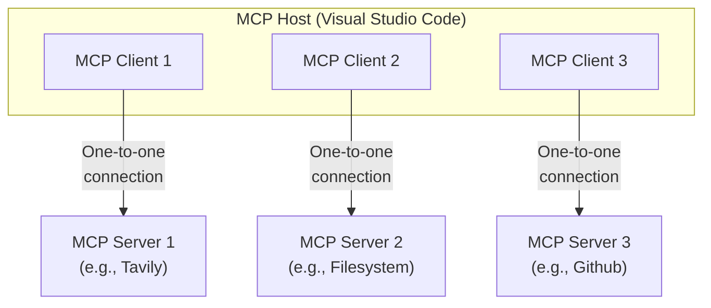

MCP follows a client-server architecture where an **MCP host** — an AI application like LM Studio or Visual Studio Code — establishes connections to one or more **MCP servers**. 

The MCP host accomplishes this by creating one **MCP client** for each MCP server. Each MCP client maintains a **dedicated one-to-one connection** with its corresponding MCP server.

### 🏗️ Key Participants 


| Participant | Role |
|---------|--------|
|🤖 **MCP Host**|The AI application that orchestrates one or more MCP clients. It uses context retrieved via these clients to enhance its reasoning, code generation, or decision-making.
 |
|🔄 **MCP Client**|A lightweight component instantiated by the MCP host for each server it connects to. Each client maintains a dedicated, one-to-one connection with a single MCP server, handling requests and responses according to the MCP spec.
 |
|🗄️ **MCP Server**|A service that exposes data or functionality (e.g., logs, files, databases) to MCP clients. The server validates requests and returns context in a structured, safe manner. Servers can be local or remote.
 |




### 🌐 Example: Visual Studio Code as an MCP Host 💡

When Visual Studio Code establishes a connection to an MCP server, such as the [Tavily MCP server](https://www.nuget.org/packages/Tavily.McpServer/0.2.0-beta), the Visual Studio Code runtime instantiates an MCP client object that maintains the connection to the Sentry MCP server. When Visual Studio Code subsequently connects to another MCP server, such as the [local filesystem server](https://github.com/modelcontextprotocol/servers/tree/main/src/filesystem), the Visual Studio Code runtime instantiates an additional MCP client object to maintain this connection, hence maintaining a one-to-one relationship of MCP clients to MCP servers.

### 🖥️⚡ Local vs Remote MCP Servers
The term **MCP server** refers to the program providing context, regardless of where it runs:


| Type | Description
|---------|--------|
|💾 **Local MCP Server**|Runs on the same machine as the MCP host, typically using efficient transports like `stdio`
 |
|☁️ **Remote MCP Server**|Hosted externally (e.g., cloud), accessed via secure transports like `Streamable HTTP`
 |


This flexibility allows MCP to unify access to both on-device and cloud-based tools under a single, consistent interface.

