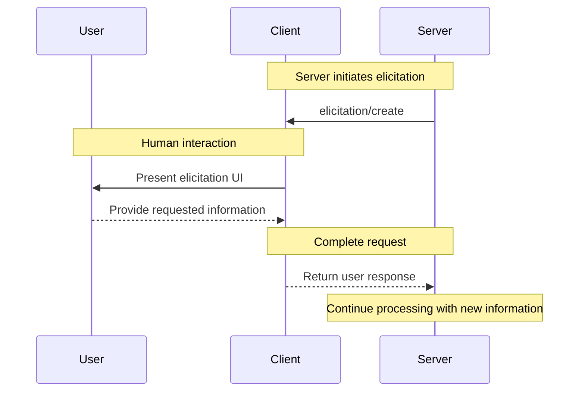

Elicitation in MCP allows servers to implement interactive workflows by enabling user input
requests to occur *nested* inside other MCP server features.

Implementations are free to expose elicitation through any interface pattern that suits
their needs—the protocol itself does not mandate any specific user interaction
model.

{}
  For trust & safety and security:

  * Servers **MUST NOT** use elicitation to request sensitive information.

  Applications **SHOULD**:

  * Provide UI that makes it clear which server is requesting information
  * Allow users to review and modify their responses before sending
  * Respect user privacy and provide clear decline and cancel options
{}

## Capabilities

Clients that support elicitation **MUST** declare the `elicitation` capability during
[initialization](/docs/concepts/architecture-overview/layers/data-layer/lifecycle-management/#initialization):

```json
{
  "capabilities": {
    "elicitation": {}
  }
}
```

## Protocol Messages

### Creating Elicitation Requests

To request information from a user, servers send an `elicitation/create` request:

#### Simple Text Request

**Request:**

```json
{
  "jsonrpc": "2.0",
  "id": 1,
  "method": "elicitation/create",
  "params": {
    "message": "Please provide your GitHub username",
    "requestedSchema": {
      "type": "object",
      "properties": {
        "name": {
          "type": "string"
        }
      },
      "required": ["name"]
    }
  }
}
```

**Response:**

```json
{
  "jsonrpc": "2.0",
  "id": 1,
  "result": {
    "action": "accept",
    "content": {
      "name": "octocat"
    }
  }
}
```

#### Structured Data Request

**Request:**

```json
{
  "jsonrpc": "2.0",
  "id": 2,
  "method": "elicitation/create",
  "params": {
    "message": "Please provide your contact information",
    "requestedSchema": {
      "type": "object",
      "properties": {
        "name": {
          "type": "string",
          "description": "Your full name"
        },
        "email": {
          "type": "string",
          "format": "email",
          "description": "Your email address"
        },
        "age": {
          "type": "number",
          "minimum": 18,
          "description": "Your age"
        }
      },
      "required": ["name", "email"]
    }
  }
}
```

**Response:**

```json
{
  "jsonrpc": "2.0",
  "id": 2,
  "result": {
    "action": "accept",
    "content": {
      "name": "Monalisa Octocat",
      "email": "octocat@github.com",
      "age": 30
    }
  }
}
```

**Reject Response Example:**

```json
{
  "jsonrpc": "2.0",
  "id": 2,
  "result": {
    "action": "decline"
  }
}
```

**Cancel Response Example:**

```json
{
  "jsonrpc": "2.0",
  "id": 2,
  "result": {
    "action": "cancel"
  }
}
```

## Message Flow



## Request Schema

The `requestedSchema` field allows servers to define the structure of the expected response using a restricted subset of JSON Schema. To simplify implementation for clients, elicitation schemas are limited to flat objects with primitive properties only:

```json
"requestedSchema": {
  "type": "object",
  "properties": {
    "propertyName": {
      "type": "string",
      "title": "Display Name",
      "description": "Description of the property"
    },
    "anotherProperty": {
      "type": "number",
      "minimum": 0,
      "maximum": 100
    }
  },
  "required": ["propertyName"]
}
```

### Supported Schema Types

The schema is restricted to these primitive types:

1. **String Schema**

   ```json
   {
     "type": "string",
     "title": "Display Name",
     "description": "Description text",
     "minLength": 3,
     "maxLength": 50,
     "format": "email" // Supported: "email", "uri", "date", "date-time"
   }
   ```

   Supported formats: `email`, `uri`, `date`, `date-time`

2. **Number Schema**

   ```json
   {
     "type": "number", // or "integer"
     "title": "Display Name",
     "description": "Description text",
     "minimum": 0,
     "maximum": 100
   }
   ```

3. **Boolean Schema**

   ```json
   {
     "type": "boolean",
     "title": "Display Name",
     "description": "Description text",
     "default": false
   }
   ```

4. **Enum Schema**
   ```json
   {
     "type": "string",
     "title": "Display Name",
     "description": "Description text",
     "enum": ["option1", "option2", "option3"],
     "enumNames": ["Option 1", "Option 2", "Option 3"]
   }
   ```

Clients can use this schema to:

1. Generate appropriate input forms
2. Validate user input before sending
3. Provide better guidance to users

Note that complex nested structures, arrays of objects, and other advanced JSON Schema features are intentionally not supported to simplify client implementation.

## Response Actions

Elicitation responses use a three-action model to clearly distinguish between different user actions:

```json
{
  "jsonrpc": "2.0",
  "id": 1,
  "result": {
    "action": "accept", // or "decline" or "cancel"
    "content": {
      "propertyName": "value",
      "anotherProperty": 42
    }
  }
}
```

The three response actions are:

1. **Accept** (`action: "accept"`): User explicitly approved and submitted with data

   * The `content` field contains the submitted data matching the requested schema
   * Example: User clicked "Submit", "OK", "Confirm", etc.

2. **Decline** (`action: "decline"`): User explicitly declined the request

   * The `content` field is typically omitted
   * Example: User clicked "Reject", "Decline", "No", etc.

3. **Cancel** (`action: "cancel"`): User dismissed without making an explicit choice
   * The `content` field is typically omitted
   * Example: User closed the dialog, clicked outside, pressed Escape, etc.

Servers should handle each state appropriately:

* **Accept**: Process the submitted data
* **Decline**: Handle explicit decline (e.g., offer alternatives)
* **Cancel**: Handle dismissal (e.g., prompt again later)

## Security Considerations

1. Servers **MUST NOT** request sensitive information through elicitation
2. Clients **SHOULD** implement user approval controls
3. Both parties **SHOULD** validate elicitation content against the provided schema
4. Clients **SHOULD** provide clear indication of which server is requesting information
5. Clients **SHOULD** allow users to decline elicitation requests at any time
6. Clients **SHOULD** implement rate limiting
7. Clients **SHOULD** present elicitation requests in a way that makes it clear what information is being requested and why