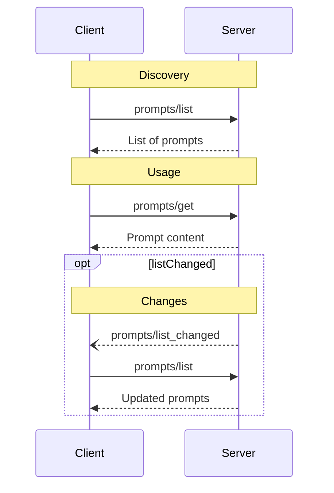

Prompts are designed to be **user-controlled**, meaning they are exposed from servers to
clients with the intention of the user being able to explicitly select them for use.

Typically, prompts would be triggered through user-initiated commands in the user
interface, which allows users to naturally discover and invoke available prompts.

For example, as slash commands:


However, implementors are free to expose prompts through any interface pattern that suits
their needs—the protocol itself does not mandate any specific user interaction
model.

## Capabilities

Servers that support prompts **MUST** declare the `prompts` capability during
[initialization](/docs/concepts/architecture-overview/layers/data-layer/lifecycle-management/#initialization):

```json
{
  "capabilities": {
    "prompts": {
      "listChanged": true
    }
  }
}
```

`listChanged` indicates whether the server will emit notifications when the list of
available prompts changes.

## Protocol Messages

### Listing Prompts

To retrieve available prompts, clients send a `prompts/list` request. This operation
supports [pagination](/docs/concepts/architecture-overview/layers/data-layer/utility-features/pagination/).

**Request:**

```json
{
  "jsonrpc": "2.0",
  "id": 1,
  "method": "prompts/list",
  "params": {
    "cursor": "optional-cursor-value"
  }
}
```

**Response:**

```json
{
  "jsonrpc": "2.0",
  "id": 1,
  "result": {
    "prompts": [
      {
        "name": "code_review",
        "title": "Request Code Review",
        "description": "Asks the LLM to analyze code quality and suggest improvements",
        "arguments": [
          {
            "name": "code",
            "description": "The code to review",
            "required": true
          }
        ]
      }
    ],
    "nextCursor": "next-page-cursor"
  }
}
```

### Getting a Prompt

To retrieve a specific prompt, clients send a `prompts/get` request. Arguments may be auto-completed through [the completion API/docs/concepts/architecture-overview/layers/data-layer/utility-features/completion/).

**Request:**

```json
{
  "jsonrpc": "2.0",
  "id": 2,
  "method": "prompts/get",
  "params": {
    "name": "code_review",
    "arguments": {
      "code": "def hello():\n    print('world')"
    }
  }
}
```

**Response:**

```json
{
  "jsonrpc": "2.0",
  "id": 2,
  "result": {
    "description": "Code review prompt",
    "messages": [
      {
        "role": "user",
        "content": {
          "type": "text",
          "text": "Please review this Python code:\ndef hello():\n    print('world')"
        }
      }
    ]
  }
}
```

### List Changed Notification

When the list of available prompts changes, servers that declared the `listChanged`
capability **SHOULD** send a notification:

```json
{
  "jsonrpc": "2.0",
  "method": "notifications/prompts/list_changed"
}
```

## Message Flow



## Data Types

### Prompt

A prompt definition includes:

* `name`: Unique identifier for the prompt
* `title`: Optional human-readable name of the prompt for display purposes.
* `description`: Optional human-readable description
* `arguments`: Optional list of arguments for customization

### PromptMessage

Messages in a prompt can contain:

* `role`: Either "user" or "assistant" to indicate the speaker
* `content`: One of the following content types:

<Note>
  All content types in prompt messages support optional
  [annotations](/docs/concepts/server-concepts/resources/#annotations) for
  metadata about audience, priority, and modification times.
</Note>

#### Text Content

Text content represents plain text messages:

```json
{
  "type": "text",
  "text": "The text content of the message"
}
```

This is the most common content type used for natural language interactions.

#### Image Content

Image content allows including visual information in messages:

```json
{
  "type": "image",
  "data": "base64-encoded-image-data",
  "mimeType": "image/png"
}
```

The image data **MUST** be base64-encoded and include a valid MIME type. This enables
multi-modal interactions where visual context is important.

#### Audio Content

Audio content allows including audio information in messages:

```json
{
  "type": "audio",
  "data": "base64-encoded-audio-data",
  "mimeType": "audio/wav"
}
```

The audio data MUST be base64-encoded and include a valid MIME type. This enables
multi-modal interactions where audio context is important.

#### Embedded Resources

Embedded resources allow referencing server-side resources directly in messages:

```json
{
  "type": "resource",
  "resource": {
    "uri": "resource://example",
    "name": "example",
    "title": "My Example Resource",
    "mimeType": "text/plain",
    "text": "Resource content"
  }
}
```

Resources can contain either text or binary (blob) data and **MUST** include:

* A valid resource URI
* The appropriate MIME type
* Either text content or base64-encoded blob data

Embedded resources enable prompts to seamlessly incorporate server-managed content like
documentation, code samples, or other reference materials directly into the conversation
flow.

## Error Handling

Servers **SHOULD** return standard JSON-RPC errors for common failure cases:

* Invalid prompt name: `-32602` (Invalid params)
* Missing required arguments: `-32602` (Invalid params)
* Internal errors: `-32603` (Internal error)

## Implementation Considerations

1. Servers **SHOULD** validate prompt arguments before processing
2. Clients **SHOULD** handle pagination for large prompt lists
3. Both parties **SHOULD** respect capability negotiation

## Security

Implementations **MUST** carefully validate all prompt inputs and outputs to prevent
injection attacks or unauthorized access to resources.